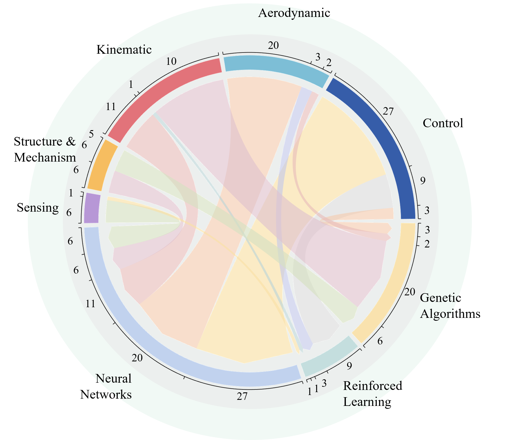
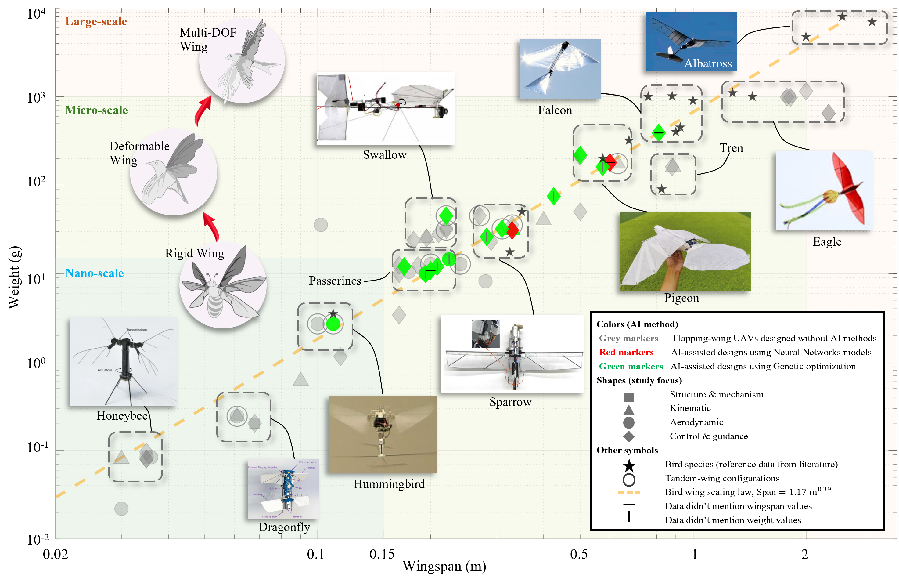
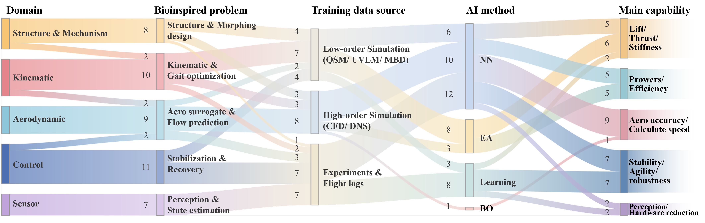
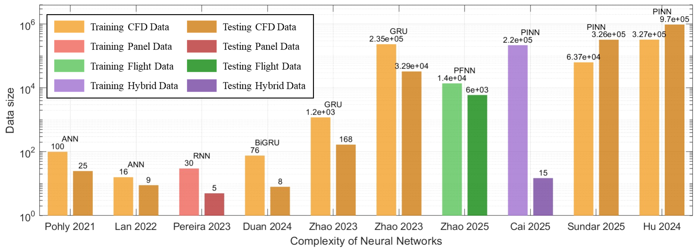

# AI-FWAV-Review
Data and MATLAB scripts for FWAV AI review figures

> Dong Y., He S., Lin D., Abdulrahman Y., "Review on the design of bio-inspired flapping-wing aerial vehicles using artificial intelligence", 2025. 

## Figure overview

- **Figure 1b – Long-term evolution of flapping-wing research output and the proportion of AI-driven studies.**  
  

- **Figure 1c – Distribution of artificial intelligence methods across major flapping-wing research domains.**  
  

- **Figure 2 – Scale distribution of flapping‑wing aerial vehicles in wingspan-weight space with representative biological flyers and AI‑assisted design exemplars. **  
  

- **Figure 4 – AI-enabled FWAV design framework: mapping from bio-inspired problems and data regimes to AI methods and capability gains.**  
  

- **Figure 11 – Training and testing data sizes used in NN-based FWAV aerodynamic studies, ordered from simpler to more complex network architectures.**  
  

## How to reproduce the figures in MATLAB

```matlab
cd matlab

fig1b_PaperSummarize;
fig1c_DomainAISankey_circle;
fig2_Catogory;
fig4_DomainAISankey_triangular;
fig11_AeroDataSource;
